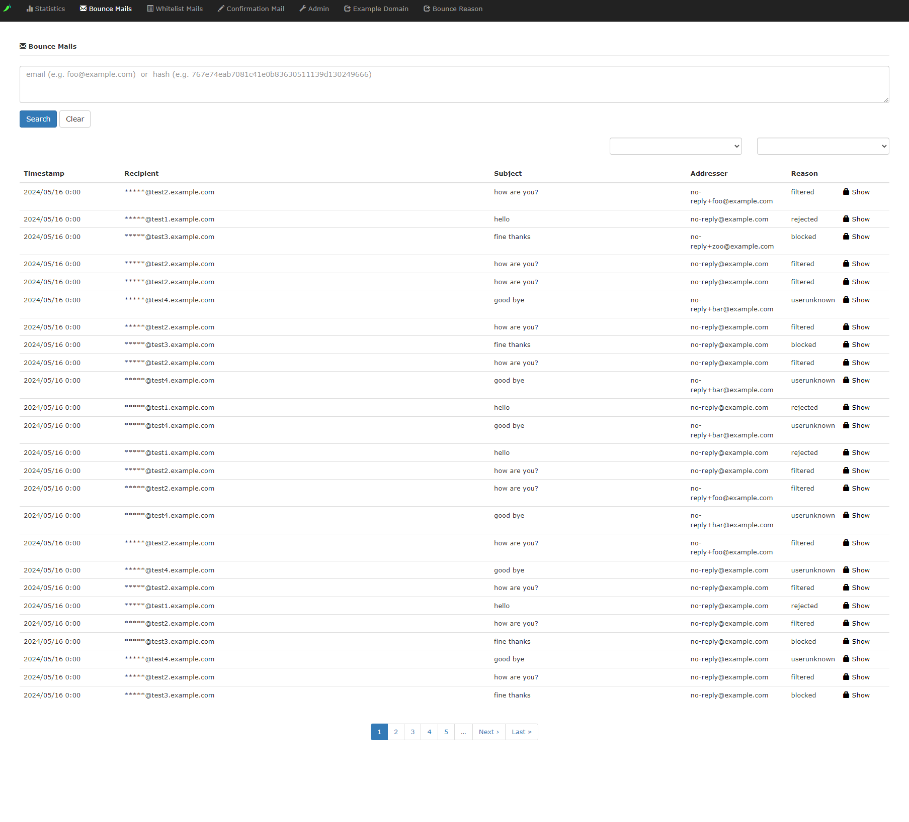

# Sisito

**🌏 Languages**: [English](README.md) | [日本語](README_ja.md)

## Overview

It is [sisimai](http://libsisimai.org/) collected data frontend.

## Screenshot

  &nbsp; 

## Installation

```console
git clone https://github.com/revsystem/sisito.git
cd sisito
bundle install
vi config/database.yml
bundle exec rails db:create db:migrate
bundle exec rails server
```

If you need to access the application from outside the server, you can run the following command. You can access the application from `http://<server-ip>:1080`.

```console
bundle exec rails server -p 1080 -b 0.0.0.0
```

### Using docker

```console
git clone https://github.com/revsystem/sisito.git
cd sisito
docker-compose build
docker-compose up
# console: http://localhost:3000
# mailcatcher: http://localhost:11080
# api: `curl localhost:8080/blacklist` (see https://github.com/revsystem/sisito-api#api)
```

## Recommended System Requirements

* Ruby 3.1.2/3.3.2
* MySQL 8.0.36 or later

## Bounced Mail Collect Script Example

```ruby
#!/usr/bin/env ruby
require 'fileutils'
require 'sisimai'
require 'mysql2'
require 'tmpdir'

COLUMNS = %w(
  timestamp
  lhost
  rhost
  alias
  listid
  reason
  action
  subject
  messageid
  smtpagent
  hardbounce
  smtpcommand
  destination
  senderdomain
  feedbacktype
  diagnosticcode
  deliverystatus
  timezoneoffset
  addresser
  recipient
)

MAIL_DIR = '/home/scott/Maildir/new'

def process(path, **options)
  Dir.glob("#{path}/**/*").each do |entry|
    next unless File.file?(entry)

    Dir.mktmpdir do |tmpdir|
      FileUtils.mv(entry, tmpdir)
      v = Sisimai.rise(tmpdir, **options) || []
      v.each {|e| yield(e) }
    end
  end
end

def insert(mysql, data)
  values = data.to_hash.values_at(*COLUMNS)
  addresseralias = data.addresser.alias
  addresseralias = data.addresser if addresseralias.empty?
  values << addresseralias.to_s
  columns = (COLUMNS + ['addresseralias', 'digest', 'created_at', 'updated_at']).join(?,)
  timestamp = values.shift
  values = (["FROM_UNIXTIME(#{timestamp})"] + values.map(&:inspect) + ['SHA1(recipient)', 'NOW()', 'NOW()']).join(?,)
  sql = "INSERT INTO bounce_mails (#{columns}) VALUES (#{values})"
  mysql.query(sql)
end

# sql:
#   INSERT INTO bounce_mails (
#     timestamp,
#     lhost,
#     rhost,
#     alias,
#     listid,
#     reason,
#     action,
#     subject,
#     messageid,
#     smtpagent,
#     hardbounce,
#     smtpcommand,
#     destination,
#     senderdomain,
#     feedbacktype,
#     diagnosticcode,
#     deliverystatus,
#     timezoneoffset,
#     addresser,
#     recipient,
#     addresseralias,
#     digest,
#     created_at,
#     updated_at
#   ) VALUES (
#     /* timestamp      */  FROM_UNIXTIME(1503152383),
#     /* lhost          */  "43b36f28aa95",
#     /* rhost          */  "",
#     /* alias          */  "user-1503152383@a.b.c",
#     /* listid         */  "",
#     /* reason         */  "hostunknown",
#     /* action         */  "failed",
#     /* subject        */  "subject-1503152383",
#     /* messageid      */  "20170819141943.A58CC35A@43b36f28aa95",
#     /* smtpagent      */  "MTA::Postfix",
#     /* hardbounce     */  0,
#     /* smtpcommand    */  "",
#     /* destination    */  "a.b.c",
#     /* senderdomain   */  "43b36f28aa95",
#     /* feedbacktype   */  "",
#     /* diagnosticcode */  "Host or domain name not found. Name service error for name=a.b.c type=AAAA: Host not found",
#     /* deliverystatus */  "5.4.4",
#     /* timezoneoffset */  "+0900",
#     /* addresser      */  "root@43b36f28aa95",
#     /* recipient      */  "user-1503152383@a.b.c",
#     /* addresseralias */  "root@43b36f28aa95",
#     /* digest         */  SHA1(recipient),
#     /* created_at     */  NOW(),
#     /* updated_at     */  NOW()
#   )

mysql = Mysql2::Client.new(host: 'db-server', username: 'root', database: 'sisito', reconnect: true)

process(MAIL_DIR) do |data|
  insert(mysql, data)
end
```

## List Blacklisted Recipients SQL Example

```sql
SELECT
  recipient
FROM
  bounce_mails bm
  LEFT JOIN whitelist_mails wm
    ON bm.recipient = wm.recipient
   AND bm.senderdomain = wm.senderdomain
WHERE
  bm.senderdomain = 'example.com'
  AND wm.id IS NULL
  /*
  AND bm.softbounce = 1
  AND bm.reason IN ('filtered')
  */
```

## Monitoring

```json
$ curl -s localhost:3000/status | jq .
{
  "start_time": "2017-08-19T22:36:08.887+09:00",
  "interval": 60,
  "count": {
    "all": 7,
    "reason": {
      "hostunknown": 7
    },
    "senderdomain": {
      "example.com": 7
    },
    "destination": {
      "any.not_exist_domain.com": 7
    }
  }
}
```

## Using Local Timezone

Please fix [config/application.rb](https://github.com/revsystem/sisito/blob/master/config/application.rb) as follows:

```ruby
module Sisito
  class Application < Rails::Application
    ...
    config.active_record.default_timezone = :local
    config.time_zone = "Tokyo"
    ...
```

## Performance Optimization for Large Datasets

For environments with hundreds of thousands or millions of bounce records, performance optimization is essential. This section covers upgrading existing installations.

### MySQL Configuration Optimization

1. **Apply MySQL Configuration**

   ```bash
   # Copy optimized MySQL configuration
   sudo cp mysql_optimization.cnf /etc/mysql/mysql.conf.d/sisito_optimization.cnf

   # for MariaDB (if you use MariaDB)
   sudo cp mysql_optimization.cnf /etc/mysql/mariadb.conf.d/sisito_optimization.cnf

   # Restart MySQL to apply settings
   sudo systemctl restart mysql
   ```

2. **Key Configuration Changes**

   ```ini
   # Increased memory allocation for large datasets
   innodb_buffer_pool_size = 2G        # 70-80% of available RAM
   tmp_table_size = 1G                  # Large temporary tables for GROUP BY
   sort_buffer_size = 32M               # Improved sorting performance
   query_cache_size = 512M              # Cache frequently used queries
   ```

### Database Index Optimization for Existing Environments

⚠️ **Important: Always backup before applying performance updates**

#### Step 1: Create Database Backup

```bash
# Create a complete backup before making changes
mysqldump -u root -p sisito_production > backup_sisito_$(date +%Y%m%d_%H%M%S).sql

# Verify backup file was created
ls -lh backup_sisito_*.sql
```

#### Step 2: Check Current Database Size

```bash
# Check table size and row count
mysql -u root -p sisito_production -e "
SELECT
    table_name,
    ROUND(((data_length + index_length) / 1024 / 1024), 2) AS 'Size_MB',
    table_rows
FROM information_schema.tables
WHERE table_schema = 'sisito_production' AND table_name = 'bounce_mails';"
```

#### Step 3: Apply Performance Indexes

```bash
# Pull latest code with performance improvements
git pull origin master

# Check migration status
bundle exec rails db:migrate:status

# Apply performance indexes (may take 30 minutes to 2 hours for large datasets)
bundle exec rails db:migrate

# Monitor progress in another terminal
mysql -u root -p sisito_production -e "SHOW FULL PROCESSLIST;"
```

#### Step 4: Verify Index Creation

```bash
# Verify all performance indexes were created
mysql -u root -p sisito_production -e "
SHOW INDEX FROM bounce_mails WHERE Key_name LIKE 'idx_%';"
```

#### Step 5: Performance Monitoring

```bash
# Run performance monitoring script
ruby monitor_performance.rb

# Check for slow queries
mysql -u root -p sisito_production -e "SHOW FULL PROCESSLIST;"
```

### Performance Indexes Applied

The following specialized indexes are added for large dataset performance:

* `idx_timestamp_addresser` - Date range analytics queries
* `idx_reason_destination` - Statistical GROUP BY operations
* `idx_recipient_senderdomain_timestamp` - Complex filtering and JOINs
* `idx_addresseralias_recipient_valid` - Conditional indexing for sender statistics
* `idx_addresser_recipient_fallback` - Fallback queries optimization

### Expected Performance Improvements

| Operation | Before Optimization | After Optimization |
|-----------|-------------------|-------------------|
| Statistics Dashboard | 15-30 seconds | 3-8 seconds |
| Search Results | 10-20 seconds | 2-5 seconds |
| Pagination | 5-10 seconds | 1-2 seconds |
| Complex Analytics | 60+ seconds | 5-15 seconds |

### Rollback Procedure (If Needed)

```bash
# If performance optimization causes issues, rollback steps:

# 1. Restore database from backup
mysql -u root -p sisito_production < backup_sisito_YYYYMMDD_HHMMSS.sql

# 2. Rollback migrations
bundle exec rails db:rollback STEP=2

# 3. Restart application
bundle exec rails server
```

### Maintenance Commands

```bash
# Regular maintenance for optimal performance
mysql -u root -p sisito_production -e "OPTIMIZE TABLE bounce_mails;"
mysql -u root -p sisito_production -e "ANALYZE TABLE bounce_mails;"

# Monitor database performance
ruby monitor_performance.rb
```

## Customize Sisito

see [config/sisito.yml](https://github.com/revsystem/sisito/blob/master/config/sisito.yml)

## Related Links

* <http://libsisimai.org>
* <https://github.com/winebarrel/sisito-api>
