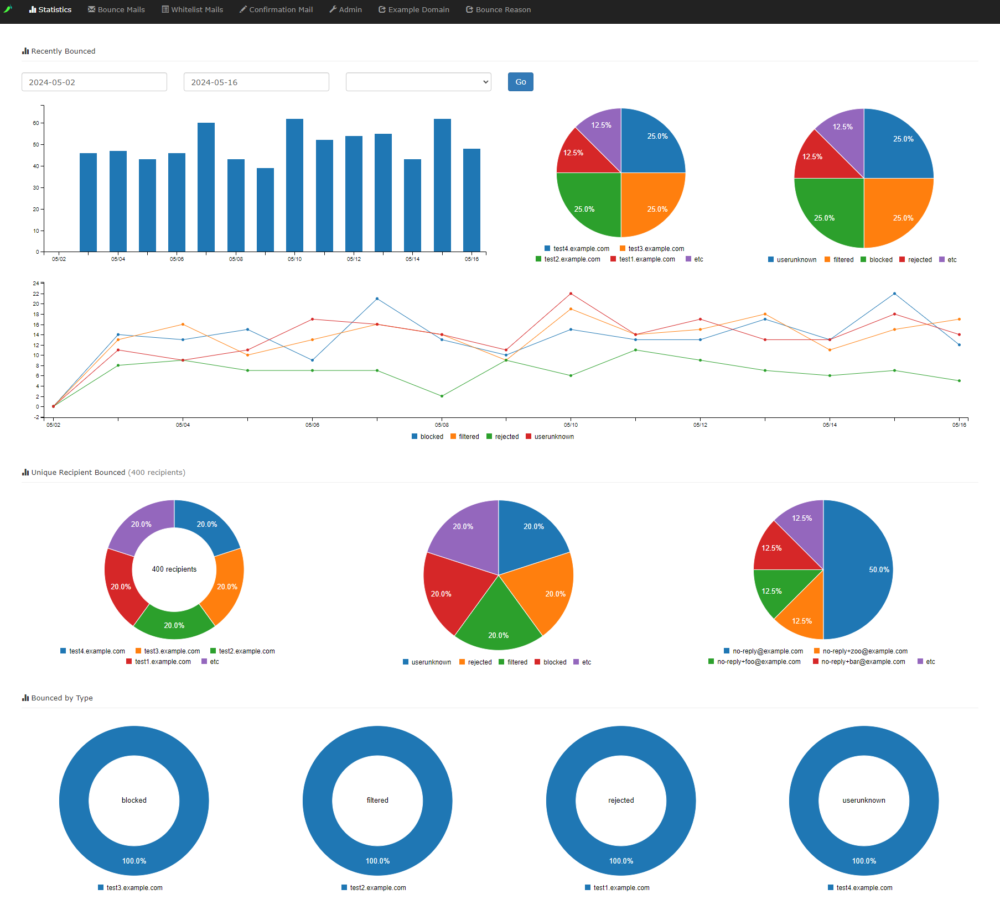

# Sisito

**🌏 言語**: [English](README.md) | [日本語](README_ja.md)

## 概要

[sisimai](http://libsisimai.org/) で収集されたバウンスメールデータを可視化するフロントエンドWebアプリケーションです。

## スクリーンショット

  &nbsp; 

## インストール

```console
git clone https://github.com/revsystem/sisito.git
cd sisito
bundle install
vi config/database.yml
bundle exec rails db:create db:migrate
bundle exec rails server
```

サーバーの外部からアクセスする場合は、以下のコマンドを実行してください。`http://<server-ip>:1080` でアクセスできます。

```console
bundle exec rails server -p 1080 -b 0.0.0.0
```

### Dockerを使用する場合

```console
git clone https://github.com/revsystem/sisito.git
cd sisito
docker-compose build
docker-compose up
# コンソール: http://localhost:3000
# mailcatcher: http://localhost:11080
# API: `curl localhost:8080/blacklist` (詳細は https://github.com/revsystem/sisito-api#api 参照)
```

## 推奨システム要件

* Ruby 3.1.2/3.3.2
* MySQL 8.0.36 以上

## バウンスメール収集スクリプト例

```ruby
#!/usr/bin/env ruby
require 'fileutils'
require 'sisimai'
require 'mysql2'
require 'tmpdir'

COLUMNS = %w(
  timestamp
  lhost
  rhost
  alias
  listid
  reason
  action
  subject
  messageid
  smtpagent
  hardbounce
  smtpcommand
  destination
  senderdomain
  feedbacktype
  diagnosticcode
  deliverystatus
  timezoneoffset
  addresser
  recipient
)

MAIL_DIR = '/home/scott/Maildir/new'

def process(path, **options)
  Dir.glob("#{path}/**/*").each do |entry|
    next unless File.file?(entry)

    Dir.mktmpdir do |tmpdir|
      FileUtils.mv(entry, tmpdir)
      v = Sisimai.rise(tmpdir, **options) || []
      v.each {|e| yield(e) }
    end
  end
end

def insert(mysql, data)
  values = data.to_hash.values_at(*COLUMNS)
  addresseralias = data.addresser.alias
  addresseralias = data.addresser if addresseralias.empty?
  values << addresseralias.to_s
  columns = (COLUMNS + ['addresseralias', 'digest', 'created_at', 'updated_at']).join(?,)
  timestamp = values.shift
  values = (["FROM_UNIXTIME(#{timestamp})"] + values.map(&:inspect) + ['SHA1(recipient)', 'NOW()', 'NOW()']).join(?,)
  sql = "INSERT INTO bounce_mails (#{columns}) VALUES (#{values})"
  mysql.query(sql)
end

mysql = Mysql2::Client.new(host: 'db-server', username: 'root', database: 'sisito', reconnect: true)

process(MAIL_DIR) do |data|
  insert(mysql, data)
end
```

## ブラックリスト受信者を取得するSQL例

```sql
SELECT
  recipient
FROM
  bounce_mails bm
  LEFT JOIN whitelist_mails wm
    ON bm.recipient = wm.recipient
   AND bm.senderdomain = wm.senderdomain
WHERE
  bm.senderdomain = 'example.com'
  AND wm.id IS NULL
  /*
  AND bm.softbounce = 1
  AND bm.reason IN ('filtered')
  */
```

## 監視

```json
$ curl -s localhost:3000/status | jq .
{
  "start_time": "2017-08-19T22:36:08.887+09:00",
  "interval": 60,
  "count": {
    "all": 7,
    "reason": {
      "hostunknown": 7
    },
    "senderdomain": {
      "example.com": 7
    },
    "destination": {
      "any.not_exist_domain.com": 7
    }
  }
}
```

## ローカルタイムゾーンの使用

[config/application.rb](https://github.com/revsystem/sisito/blob/master/config/application.rb) を以下のように修正してください：

```ruby
module Sisito
  class Application < Rails::Application
    ...
    config.active_record.default_timezone = :local
    config.time_zone = "Tokyo"
    ...
```

## 大規模データセット向けパフォーマンス最適化

数十万〜数百万件のバウンスレコードを扱う環境では、パフォーマンス最適化が必要です。このセクションでは既存インストールのアップグレード方法を説明します。

### MySQL設定の最適化

1. **MySQL設定の適用**

   ```bash
   # 最適化されたMySQL設定をコピー
   sudo cp mysql_optimization.cnf /etc/mysql/mysql.conf.d/sisito_optimization.cnf

   # MariaDBを使用している場合
   sudo cp mysql_optimization.cnf /etc/mysql/mariadb.conf.d/sisito_optimization.cnf

   # MySQLを再起動して設定を適用
   sudo systemctl restart mysql
   ```

2. **主要な設定変更項目**

   ```ini
   # 大規模データセット用のメモリ割り当て増加
   innodb_buffer_pool_size = 2G        # 利用可能RAMの70-80%
   tmp_table_size = 1G                  # GROUP BY用の大規模一時テーブル
   sort_buffer_size = 32M               # ソート性能の向上
   query_cache_size = 512M              # 頻繁に使用されるクエリのキャッシュ
   ```

### 既存環境でのデータベースインデックス最適化

⚠️ **重要: パフォーマンス更新を適用する前に必ずバックアップを作成してください**

#### ステップ1: データベースバックアップの作成

```bash
# 変更を行う前に完全なバックアップを作成
mysqldump -u root -p sisito_production > backup_sisito_$(date +%Y%m%d_%H%M%S).sql

# バックアップファイルが作成されたことを確認
ls -lh backup_sisito_*.sql
```

#### ステップ2: 現在のデータベースサイズを確認

```bash
# テーブルサイズと行数を確認
mysql -u root -p sisito_production -e "
SELECT
    table_name,
    ROUND(((data_length + index_length) / 1024 / 1024), 2) AS 'Size_MB',
    table_rows
FROM information_schema.tables
WHERE table_schema = 'sisito_production' AND table_name = 'bounce_mails';"
```

#### ステップ3: パフォーマンスインデックスの適用

```bash
# パフォーマンス改善を含む最新コードを取得
git pull origin master

# マイグレーション状況を確認
bundle exec rails db:migrate:status

# パフォーマンスインデックスを適用（大規模データセットでは30分〜2時間かかる場合があります）
bundle exec rails db:migrate

# 別のターミナルで進行状況を監視
mysql -u root -p sisito_production -e "SHOW FULL PROCESSLIST;"
```

#### ステップ4: インデックス作成の確認

```bash
# すべてのパフォーマンスインデックスが作成されたことを確認
mysql -u root -p sisito_production -e "
SHOW INDEX FROM bounce_mails WHERE Key_name LIKE 'idx_%';"
```

#### ステップ5: パフォーマンス監視

```bash
# パフォーマンス監視スクリプトを実行
ruby monitor_performance.rb

# 遅いクエリを確認
mysql -u root -p sisito_production -e "SHOW FULL PROCESSLIST;"
```

### 適用されるパフォーマンスインデックス

大規模データセットのパフォーマンス向上のため、以下の専用インデックスが追加されます：

* `idx_timestamp_addresser` - 日付範囲分析クエリ用
* `idx_reason_destination` - 統計GROUP BY操作用
* `idx_recipient_senderdomain_timestamp` - 複雑なフィルタリングとJOIN用
* `idx_addresseralias_recipient_valid` - 送信者統計用条件付きインデックス
* `idx_addresser_recipient_fallback` - フォールバッククエリ最適化用

### 期待されるパフォーマンス改善

| 操作 | 最適化前 | 最適化後 |
|------|----------|----------|
| 統計ダッシュボード | 15-30秒 | 3-8秒 |
| 検索結果 | 10-20秒 | 2-5秒 |
| ページネーション | 5-10秒 | 1-2秒 |
| 複雑な分析 | 60秒以上 | 5-15秒 |

### ロールバック手順（必要な場合）

```bash
# パフォーマンス最適化で問題が発生した場合のロールバック手順：

# 1. バックアップからデータベースを復元
mysql -u root -p sisito_production < backup_sisito_YYYYMMDD_HHMMSS.sql

# 2. マイグレーションをロールバック
bundle exec rails db:rollback STEP=2

# 3. アプリケーションを再起動
bundle exec rails server
```

### メンテナンスコマンド

```bash
# 最適なパフォーマンスのための定期メンテナンス
mysql -u root -p sisito_production -e "OPTIMIZE TABLE bounce_mails;"
mysql -u root -p sisito_production -e "ANALYZE TABLE bounce_mails;"

# データベースパフォーマンスの監視
ruby monitor_performance.rb
```

## Sisitoのカスタマイズ

詳細は [config/sisito.yml](https://github.com/revsystem/sisito/blob/master/config/sisito.yml) を参照してください。

## 関連リンク

* <http://libsisimai.org>
* <https://github.com/winebarrel/sisito-api>

